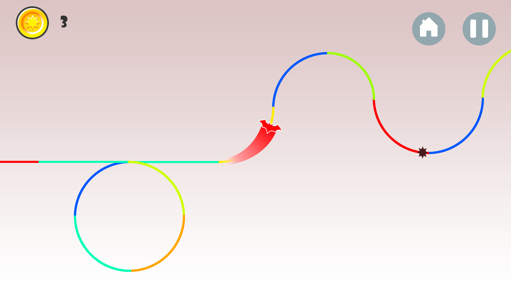

# RollocoBall
Second game on Unity3D Engine, simple one touch game was inspired by Roller coasters

## Links

Youtube - https://www.youtube.com/watch?v=3UbeWYjb57s&t=9s
IOS - https://goo.gl/61M2VV
Android - https://goo.gl/mZ0ZaY

## History

This is my second project on Unity Engine. We've created this game alogn with my brother [AnvarArt] (https://github.com/AnvarArt).
This project was a result of my first trip to the USA. We were amused that there was a Roller coaster in each city we've visited (NY - Las Vegas - Los Angeles). And as a true developer, I wanted to reflect my feelings through my work. That's how this game was born.

### Prerequisites

In order to run this project you need Unity3D Engine.

### Installing

Use Spacebar to play in simulation mode

## License

This project is licensed under the MIT License - see the [LICENSE.md](LICENSE.md) file for details

